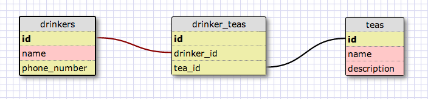

#Schema

This Sinatra app has a database with the following schema. 



##This is a two part drill 

1. Create ActiveRecord associations to match this schema. 
2. In the console, use the console to test if every one of your associations are correct. 

##There are two goals for this setup:
1. Convince yourself that you know how to test if you've set up the assocations correctly via the console.
2. Drill until assocations are muscle memory. 


#Setup: 

In the folder ActiveRecord_Associations_Drill_Skeleton, run the following commands.

```
  rake db:create
  rake db:migrate
  rake db:create
```

You are now setup to be able to add ActiveRecord Associations. You have empty models and some seed data to play with.  Suggestion: open the rake console and see if you know how to test if an assoication exists.  Close the rake console. Then open the model file, add one association, then open the rake console and test if you successfully hooked two models together.

Have fun!


Don't edit the master project.  Instead, use

```
  git checkout -b YourNameHere/NumberOfTimesDrilled
```

For example, if this is your first drill, use

```
   git checkout -b Tara/Drill1
```

This will put you on a clean branch, so that you don't write over the main branch and have to delete stuff when you are getting started again. 